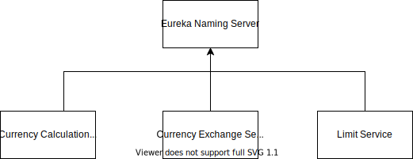

## An Example Monorepo of Microservices Application Built Using Spring-Cloud

## Micro Services and Corresponding Ports
|Application|Port|
|--- |--- |
|Limits Service|8080, 8081, ...|
|Spring Cloud Config Server|8888|
|||
|Currency Exchange Service|8000, 8001, 8002, ..|
|Currency Conversion Service|8100, 8101, 8102, ...|
|Netflix Eureka Naming Server|8761|
|Netflix Zuul API Gateway Server|8765|
|Zipkin Distributed Tracing Server|9411|
## Eureka Naming Server

## Ribbon Load Balancing

## Distributed Tracing

